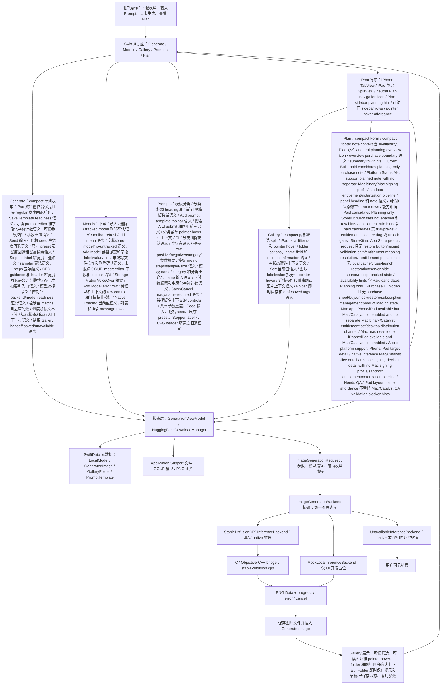
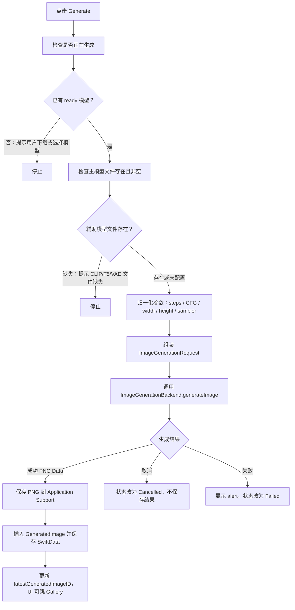
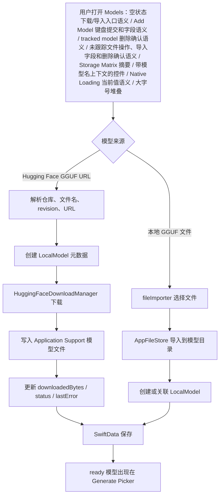
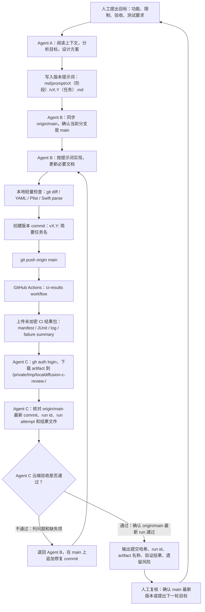
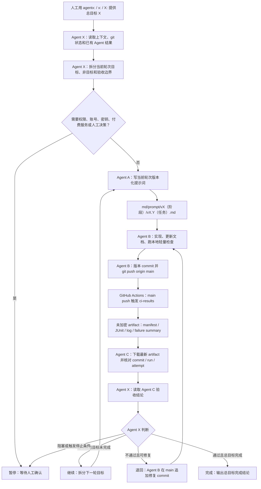
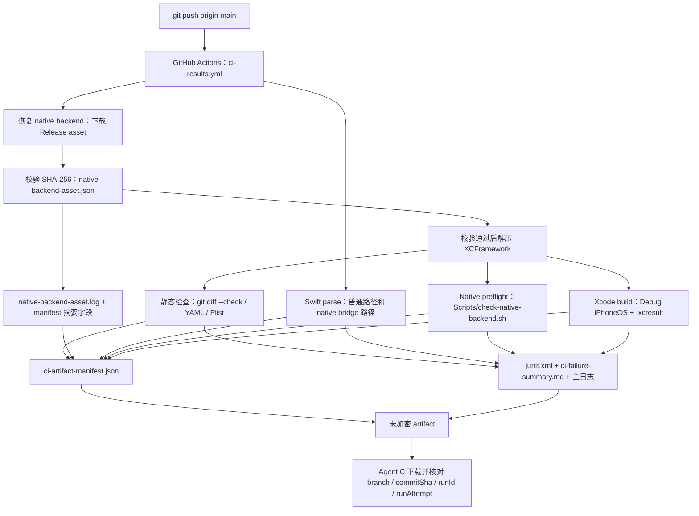
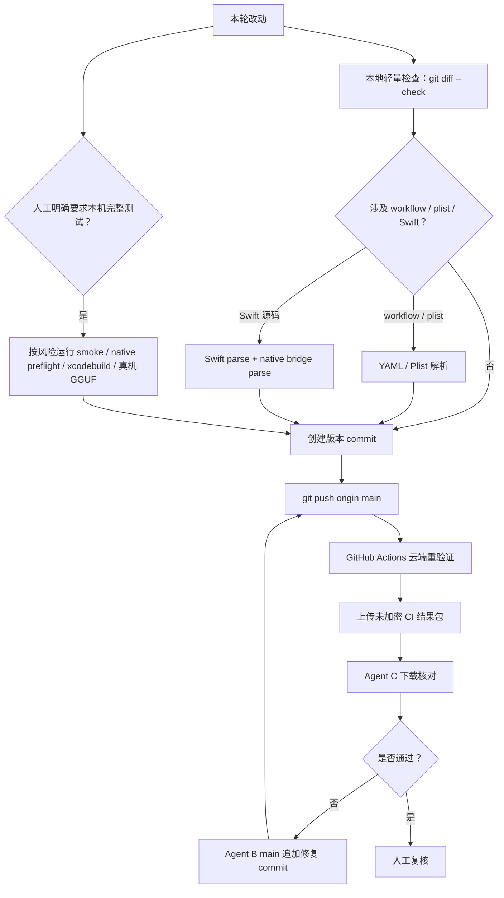

# 项目流程图

本文用 Mermaid 展示当前核心数据流、执行流和 Agent 迭代流。每张图前都有通俗读图说明，方便人工快速理解。

## 1. 项目核心逻辑图

读图说明：从左到右看，用户先准备模型和参数，SwiftUI 把操作交给状态层，状态层读写 SwiftData 与文件系统，再通过统一后端接口进入 native/mock/unavailable 推理分支，最后把图片保存并回到 UI 展示。

## 2. 图片生成执行流

读图说明：这张图只看点击 Generate 后发生什么。关键点是先校验模型和文件，再归一化参数，然后通过后端生成；成功才保存文件和 SwiftData，取消或失败不保存半成品。

## 3. 模型准备数据流

读图说明：模型可以来自 Hugging Face URL 或本地 GGUF 导入。SwiftData 保存的是元数据，大文件保存在 Application Support；两者必须保持一致。

## 4. Agent 云端迭代流程图

读图说明：人工先提出目标，Agent A 只负责分析和写实现提示词；Agent B 在 `main` 上实现、轻量检查、提交并 push；GitHub Actions 生成未加密结果包；Agent C 下载结果包并核对最新 `origin/main` 的 commit、run 和日志。不通过就退回 Agent B 在 `main` 上追加修复 commit；通过才交给人工复核。

## 5. Agent X 主控循环流程图

读图说明：人工用 `agentx:` 给出总目标后，Agent X 只负责拆分轮次和判断下一步。每一轮仍必须经过 Agent A 提示词、Agent B 实现并 push、GitHub Actions artifact、Agent C 下载复判。Agent X 只能基于 Agent C 的最新结果决定继续、退回、暂停或完成。

## 6. CI 结果包数据流

读图说明：这张图只看 `main` push 后云端产物如何形成。Agent C 后续只核对此结果包，不把旧 artifact、旧输出或 Agent B 文字汇报当作验收依据。

## 7. 测试分层选择图

读图说明：默认本地只做轻量检查，完整构建和可追溯结果包交给 GitHub Actions。只有人工明确要求本机 build、simulator 或 native 重验证时，才把这些作为本机默认路径。

